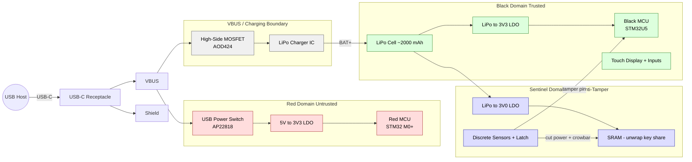
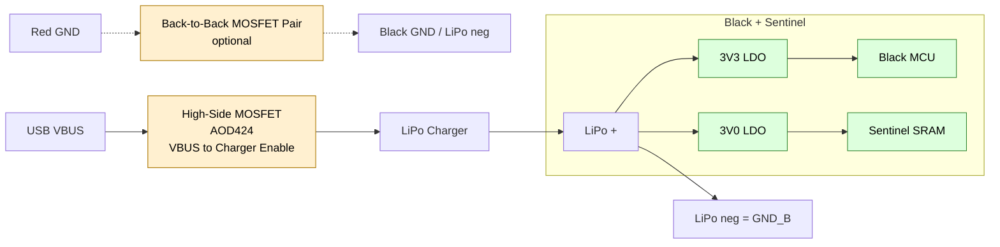
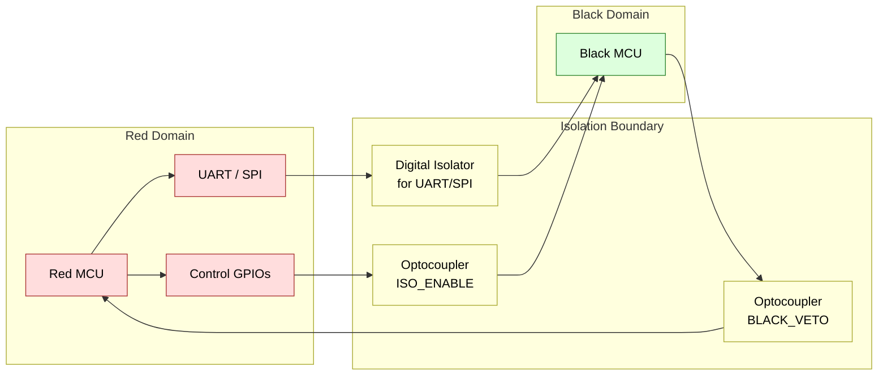
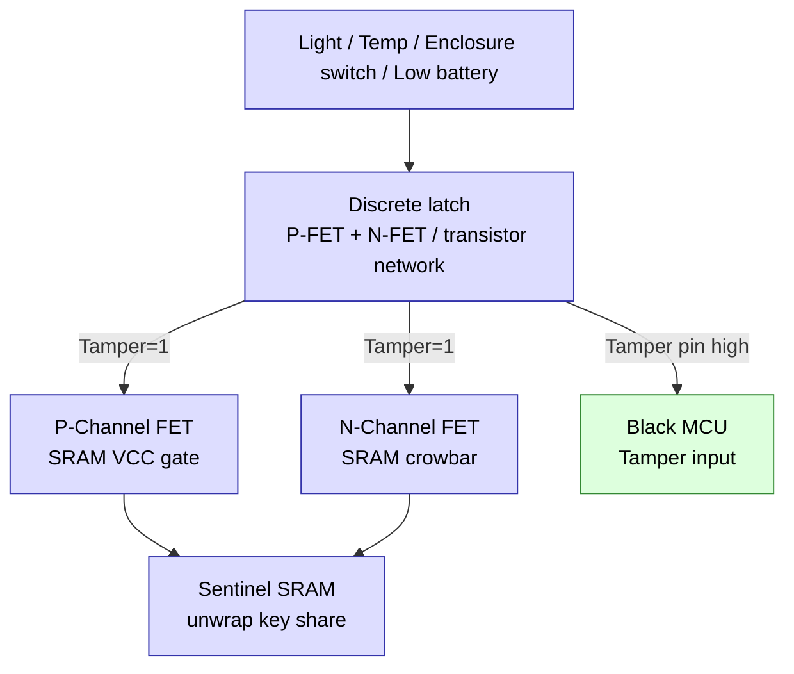

# Project Wimbledon – Cryptographic Token EE Architecture (Draft 1)

## 1. High-Level Overview

- Single 4-layer PCB, USB-C connector, three domains: Red (untrusted USB & charger), Black (trusted crypto + UI), Sentinel (active anti-tamper).
- Black runs all crypto and HMI from a 2000 mAh LiPo via 3.3 V LDO; Sentinel has its own 3.0 V LDO off the same LiPo for low-voltage survivability.
- Red is USB-powered only and talks to Black through isolated data paths + switchable power and (optionally) ground, so Black can become an electrically floating “crypto island” during sensitive operations.

## 2. Domain-Level Architecture



**Key points:**
- VBUS splits: one branch to Red (USB_SW + LDO), one to LiPo charger (under MOSFET control) feeding Black/Sentinel.
- Star point is effectively the LiPo node when switches are closed; during crypto isolation we break that star (see §3).

---

## 3. Power and Ground Isolation

Goal: during Crypto_Isolated state, Black+Sentinel float on the LiPo, with no DC path for current to return to USB/Red.

### 3.1 Power/Ground Switching Concept



- **P_SW**: MOSFET (AOD424) controlling VBUS to charger path.
- **GND_SW**: optional back-to-back MOSFET pair interrupting the Red–Black ground tie.
- Charger/LiPo node on Black side is heavily decoupled (bulk + 100 nF to GND_B, with small series R/ferrite after P_SW) to low-pass any residual AC coupling through the MOSFETs.

When P_SW=OFF and (if fitted) GND_SW=OPEN, there is no DC conduction path from LiPo/Black to USB/Red. Only residual parasitic capacitance remains (PCB, MOSFETs, isolator internals).

### 3.2 Isolation State Machine

```mermaid
stateDiagram-v2
  [*] --> Idle_Connected

  state “Idle Connected” as Idle_Connected
  note right of Idle_Connected
    Charger & GND switches closed
    Isolators enabled
    Normal USB operation
  end note

  state “Crypto Isolated” as Crypto_Isolated
  note right of Crypto_Isolated
    P_SW off, GND_SW open (if present)
    Charger off, Red fully isolated
    Black+Sentinel on LiPo only
    UART/CTRL isolators disabled
  end note

  state “Rejoin” as Rejoin
  note right of Rejoin
    Re-close GND_SW (if present) & P_SW
    Wait rails settle
    Re-enable isolators
  end note

  Idle_Connected --> Crypto_Isolated: Crypto_Request from Red
  Crypto_Isolated --> Rejoin: Crypto_Done from Black
  Rejoin --> Idle_Connected

```

**Feasibility note:** Your requirement “no shared ground or electrical links whatsoever” is physically impossible in the literal sense (there is always some capacitive coupling), but no DC/low-frequency conduction path is achievable with switched power+ground and disabled isolators; for USB-side power analysis this is effectively “electrically isolated.”


## 4. Data Isolation (Red ↔ Black)

### 4.1 Logical Data Path



**Behaviour:**
- Normal state: isolator powered both sides, Red ↔ Black command protocol active.
- Crypto_Isolated: isolator Black side unpowered / disabled, optos LEDs off; no meaningful data path, only minute parasitic coupling through the package.

---

## 5. Sentinel (Active Anti-Tamper Rail)

### 5.1 Sentinel Kill Path



**Semantics:**
- Sentinel runs from 3.0 V LDO so it remains alive in low-battery conditions.
- On tamper:
  - PWR_FET turns off, removing SRAM supply.
  - CROW_FET turns on, shorting SRAM VCC to GND (fast discharge).
  - Tamper pin to Black MCU is asserted; Black’s exact response is a software-side policy (TBD).


## 6. USB-Facing Red Domain

### 6.1 USB Composite Roles

Red MCU (USB FS hard core) is untrusted, USB-powered, and can enumerate:
- WebAuthn / FIDO2 token
- CCID / OpenPGP card
- USB HID keyboard (auto-type credentials / OTPs)
- USB mass storage (encrypted export/import of wrapped material)
- Virtual COM / custom protocol (for advanced control)

All of these speak to Black only through the isolated link, with Black as policy authority (Red cannot mint signatures or unwrap keys on its own).


## 7. Minimal "Anchor" BOM (Draft, Abstracted)

Purely to tie diagrams to symbols; not a procurement BOM yet.

| Ref | Domain | Function | Circuit Function | Notes |
|-----|--------|----------|------------------|-------|
| R_MCU | Red | STM32 M0+ with USB FS | USB interface controller - handles all USB enumeration and host communication in the untrusted domain | USB composite front-end |
| B_MCU | Black | STM32U5 (M33 + TrustZone) | Main crypto processor - performs all cryptographic operations, manages keys, and controls the HMI in the trusted domain | Crypto + UI |
| CHG | Boundary | LiPo charger IC | Battery charging controller - manages safe charging of the LiPo cell from USB power when P_SW is closed | Fed from USB via P_SW (AOD424) |
| BAT | Black | 1-cell LiPo (~2000 mAh) | Power source for isolated operation - provides energy to Black and Sentinel domains when electrically isolated from USB | Only energy source in crypto |
| B_LDO | Black | 3.3 V LDO from LiPo | Black domain voltage regulator - converts LiPo voltage to stable 3.3V for Black MCU and HMI components | Black logic / HMI supply |
| S_LDO | Sentinel | 3.0 V LDO from LiPo | Sentinel domain voltage regulator - provides stable 3.0V for anti-tamper circuitry with low-voltage operation capability | Sentinel + SRAM |
| S_SRAM | Sentinel | Volatile SRAM | Key material storage - holds one share of the unwrap key; loses contents instantly when tamper detected | Stores unwrap key share |
| USB_SW | Red | USB power switch (AP22818) | Red domain power control - switches VBUS to Red LDO with current limiting and short-circuit protection | VBUS to Red 3V3 |
| P_SW | Boundary | High-side MOSFET switch (AOD424) | Charging isolation switch - electrically disconnects USB power from battery charger during crypto operations | Cuts USB→battery energy path |
| GND_SW | Boundary | Back-to-back MOSFET pair in GND path | Ground isolation switch - breaks the ground connection between Red and Black domains for complete electrical isolation | Optional: breaks Red–Black ground tie |
| ISO_UART | Boundary | Digital isolator | Galvanically isolated data path - enables UART/SPI communication between Red and Black while maintaining electrical isolation | UART/SPI command link |
| OPTO_* | Boundary | Optocouplers | Optically coupled control signals - transmit simple control lines (ISO_ENABLE, BLACK_VETO) across isolation barrier | Simple control lines |

## 8. Appendix – ASCII Diagrams (Phone-Friendly)

### 8.1 System Domains (Coarse)

```
[ USB Host ] --[ USB-C ]--+---> [ Red Domain ]
                          |       |
                          |       +-- USB_SW (AP22818)
                          |       |
                          |       +-- 5V->3V3 LDO
                          |       |
                          |       +-- Red MCU (STM32 M0+)
                          |
                          +---> [ P_SW (AOD424) ] -> [ LiPo Charger ] 
                                                            |
                                                            v
                                                        [ LiPo Cell ]
                                                        (~2000 mAh)
                                                            |
                                  +-------------------------+-------------------------+
                                  |                                                   |
                                  v                                                   v
                          [ Black Domain ]                                  [ Sentinel Domain ]
                                  |                                                   |
                            3V3 LDO (from LiPo)                               3V0 LDO (from LiPo)
                                  |                                                   |
                        +---------+---------+                               +---------+---------+
                        |                   |                               |                   |
                        v                   v                               v                   v
                  Black MCU (STM32U5)   HMI/Display                      SRAM            Sensors/Latch
                  (Crypto + UI)         (Touch input)                (Key share)      (Tamper detect)
```

### 8.2 Power / Ground Isolation (Detailed)

```
USB Host                                              Black + Sentinel Domains
   |                                                           |
   +-- VBUS (5V) ---+                                          |
                    |                                          |
                    +---> [ USB_SW (AP22818) ]                 |
                    |            |                             |
                    |            v                             |
                    |     [ R_LDO: 5V->3V3 ]                   |
                    |            |                             |
                    |            v                             |
                    |      [ Red MCU ]                         |
                    |                                          |
                    +---> [ P_SW (AOD424) ]                    |
                                 |                             |
                         (CONTROLLABLE OPEN)                   |
                                 |                             |
                                 v                             |
                          [ LiPo Charger ]                     |
                                 |                             |
                                 v                             |
                          [ LiPo Cell + ]<---------------------+
                                 |
                                 v
                          [ LiPo Cell - ] = GND_B
                                 |
                         (CONTROLLABLE OPEN)
                                 |
                                 v
                          [ GND_SW (optional) ]
                          (Back-to-back MOSFETs)
                                 |
                                 v
                              GND_R (Red/USB ground)
                                 |
                                 v
                           USB Host Ground

When ISOLATED (crypto mode):
  - P_SW = OPEN    (no charging current)
  - GND_SW = OPEN  (no ground path)
  - Black+Sentinel float on LiPo only
  - Only parasitic capacitance couples domains
```

### 8.3 Data Isolation Boundary (Detailed)

```
        Red Domain                  Isolation Barrier               Black Domain
             |                              |                             |
    +--------+--------+                     |                    +--------+--------+
    |                 |                     |                    |                 |
    v                 v                     |                    |                 |
[ Red MCU ]      [ Red GPIOs ]              |              [ Black MCU ]      [ Black GPIOs ]
    |                 |                     |                    ^                 ^
    |                 |                     |                    |                 |
    +-- UART_TX ------+---> [ ISO_UART ] ---+---> UART_RX -------+                 |
    |                 |     (Digital        |                    |                 |
    +-- UART_RX <-----+---- Isolator ) <----+---- UART_TX -------+                 |
    |                 |                     |                    |                 |
    |                 |                     |                    |                 |
    +-- ISO_EN -------+---> [ OPTO_EN  ] ---+---> ISO_EN_IN -----+                 |
    |                      (Optocoupler)    |                                      |
    |                                       |                                      |
    +-- VETO_IN <--------------------------+---- [ OPTO_VETO ] <------ VETO ------+
                          (Optocoupler)    |

Control Modes:
  Normal: ISO_UART powered both sides, data flows freely
  Isolated: ISO_UART Black-side unpowered, optos LEDs off
            -> no meaningful signal coupling
```

### 8.4 Sentinel Kill Path (Detailed)

```
                           Sentinel Domain (3.0V LDO from LiPo)
                                      |
                    +-----------------+-----------------+
                    |                 |                 |
                    v                 v                 v
            [ Light Sensor ]  [ Temp Sensor ]  [ Enclosure Switch ]
            [ Low Battery ]   [ Other Sensors ]
                    |                 |                 |
                    +--------+--------+--------+--------+
                             |
                             v
                      [ Discrete Latch ]
                      (P-FET + N-FET network)
                             |
                    +--------+--------+--------+
                    |                 |        |
                    |                 |        +-------> Black MCU (Tamper pin)
                    |                 |                  (alerts Black of tamper event)
                    v                 v
            [ PWR_FET (P-ch) ]   [ CROW_FET (N-ch) ]
                    |                 |
                    v                 v
              Cuts SRAM VCC      Shorts SRAM VCC to GND
                    |                 |
                    +--------+--------+
                             |
                             v
                    [ Sentinel SRAM ]
                    (unwrap key share)

Power Flow (Normal):
  LiPo -> 3V0 LDO -> PWR_FET -> SRAM VCC -> SRAM
                          ^
                          |
  CROW_FET = OFF (not conducting to GND)

Power Flow (Tamper Detected):
  LiPo -> 3V0 LDO -> PWR_FET = OFF (no power to SRAM)
                          |
  CROW_FET = ON -> shorts SRAM VCC to GND
  Result: SRAM loses contents in microseconds
```

### 8.5 USB Composite Device Roles

```
                    [ USB Host / PC ]
                            |
                            | USB-C Cable
                            v
                    +-------+-------+
                    | USB-C Port    |
                    | (Device Mode) |
                    +-------+-------+
                            |
                            v
                    [ Red MCU (STM32 M0+) ]
                    | USB FS Hard Core    |
                    +---------------------+
                            |
            +---------------+---------------+
            |               |               |
            v               v               v
    [ WebAuthn/FIDO2 ] [ CCID/OpenPGP ] [ USB HID ]
            |               |               |
            +-------+-------+-------+-------+
                    |               |
                    v               v
            [ USB Mass Storage ] [ Virtual COM ]
                            |
                            v
                    [ Isolated Data Link ]
                    (Digital Isolator + Optos)
                            |
                            v
                    [ Black MCU (STM32U5) ]
                    | Crypto + Policy Authority |
                    +---------------------------+

Note: Red MCU cannot perform crypto operations
      All sensitive operations delegated to Black MCU
```

### 8.6 Complete System State Diagram (Isolation Modes)

```
                    +------------------+
                    | Initial Power-Up |
                    +------------------+
                            |
                            v
                    +------------------+
        +---------->| Idle Connected   |<----------+
        |           |                  |           |
        |           | - Charger ON     |           |
        |           | - GND_SW Closed  |           |
        |           | - Isolators ON   |           |
        |           | - Normal USB Ops |           |
        |           +------------------+           |
        |                   |                      |
        |                   | Crypto Request       |
        |                   | from Red             |
        |                   v                      |
        |           +------------------+           |
        |           | Transitioning    |           |
        |           | to Isolated      |           |
        |           |                  |           |
        |           | - Close P_SW     |           |
        |           | - Open GND_SW    |           |
        |           | - Disable Isols  |           |
        |           +------------------+           |
        |                   |                      |
        |                   v                      |
        |           +------------------+           |
        |           | Crypto Isolated  |           |
        |           |                  |           |
        |           | - P_SW OFF       |           |
        |           | - GND_SW OPEN    |           |
        |           | - Isolators OFF  |           |
        |           | - Black Floating |           |
        |           | - On LiPo only   |           |
        |           +------------------+           |
        |                   |                      |
        |                   | Crypto Complete      |
        |                   | from Black           |
        |                   v                      |
        |           +------------------+           |
        |           | Rejoining        |           |
        |           |                  |           |
        |           | - Close GND_SW   |           |
        |           | - Close P_SW     |           |
        |           | - Wait settle    |           |
        |           | - Enable Isols   |           |
        |           +------------------+           |
        |                   |                      |
        +-------------------+----------------------+

Special Events:
  - Tamper Detected -> Sentinel kills SRAM immediately
  - Low Battery -> Warning, may enter safe mode
  - USB Disconnect -> Battery operation only
```

### 8.7 Signal Legend and Conventions

```
Arrows:
  ---->   Unidirectional signal or power flow
  <---->  Bidirectional signal or data
  -.-.-   Optional or switchable connection
  
Components:
  [ ]     Functional block or IC
  ( )     Additional description or part number
  
Power Rails:
  VBUS    USB bus voltage (~5V)
  LiPo+   LiPo positive terminal (3.7V nominal)
  GND_R   Red domain ground (tied to USB ground when connected)
  GND_B   Black domain ground (LiPo negative)
  
Control Signals:
  HIGH    Logic high / enabled / closed switch
  LOW     Logic low / disabled / open switch
  FLOAT   High impedance / disconnected
```